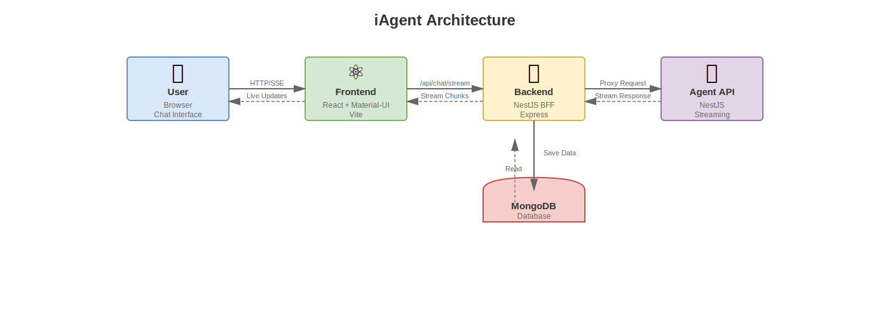

# 🤖 iAgent - AI Chat Application

> **📖 Documentation:**
> - **[DESIGN_PATTERNS_GUIDE.md](./DESIGN_PATTERNS_GUIDE.md)** - Generic design patterns and architectural principles (read first)
> - **[INFRASTRUCTURE_GUIDE.md](./INFRASTRUCTURE_GUIDE.md)** - Project-specific implementation details
> - **[STYLE_GUIDE.md](./STYLE_GUIDE.md)** - CSS style guidelines and design system
> - **[.cursorrules](./.cursorrules)** - AI assistant rules and patterns

[](https://nx.dev)
[](https://www.typescriptlang.org/)
[](https://reactjs.org/)
[](https://mui.com/)
[](https://tailwindcss.com/)
[](https://nestjs.com/)

A modern, full-stack AI chat application built with React, NestJS, and TypeScript in an Nx monorepo. Features real-time streaming, multi-language support, and a beautiful Material-UI interface.

## ✨ Features

- 🔄 **Real-time Streaming** - Live AI response streaming with Server-Sent Events
- 🌍 **Multi-language Support** - English, Hebrew, Arabic with RTL/LTR support
- 🎨 **Modern UI** - Beautiful Material-UI components with dark/light themes
- 📱 **Mobile Responsive** - Optimized for all screen sizes
- 🛡️ **Type Safe** - Full TypeScript implementation
- 📚 **API Documentation** - Comprehensive Swagger/OpenAPI docs
- 🎯 **Mock Mode** - Built-in mock responses for development
- 💾 **Persistent Storage** - Conversation history and preferences

## 🏗️ Architecture

The iAgent application follows a microservices architecture with a Backend-for-Frontend (BFF) pattern:



### Architecture Overview

```
iAgent/
├── apps/
│   ├── frontend/          # React application with Material-UI (Port 4200)
│   ├── backend/           # NestJS BFF - Chat persistence & proxy (Port 3030)
│   └── agent-api/         # NestJS streaming service (Port 3033)
├── libs/
│   ├── chat-types/        # Shared DTOs and types
│   └── shared-renderer/   # Markup parsing utilities
├── docs/                  # Documentation
└── scripts/               # Build and deployment scripts
```

### Request Flow

1. **Frontend** → Sends chat request to **Backend** via HTTP/SSE
2. **Backend** → Validates request, saves user message to MongoDB
3. **Backend** → Proxies request to **Agent API** for streaming
4. **Agent API** → Generates streaming response with mock data
5. **Backend** → Streams chunks back to **Frontend** and saves final message to MongoDB

### Components

- **Frontend (React)**: User interface with real-time streaming, multi-language support, and chat management
- **Backend (BFF)**: Handles authentication, chat persistence (MongoDB), file management, and proxies streaming requests
- **Agent API**: Dedicated service for streaming logic, mock generation, and response formatting
- **Shared Libraries**: Common DTOs and utilities used across all applications

## 🚀 Quick Start

### Prerequisites

- Node.js >= 18.0.0
- npm >= 8.0.0

### Installation & Development

```bash
# Clone the repository
git clone https://github.com/morbargig/iAgent.git
cd iAgent

# Install dependencies
npm install

# Start the frontend (React app with Vite)
npx nx serve @iagent/frontend
# The app will be available at: http://localhost:4200/iAgent/

# Start the backend (NestJS BFF)
npx nx serve @iagent/backend
# The API will be available at: http://localhost:3030

# Start the agent-api (NestJS streaming service)
npx nx serve agent-api
# The API will be available at: http://localhost:3033

# Or use npm scripts to start all services
npm run dev  # Starts frontend, backend, and agent-api concurrently
```

### Available Scripts

```bash
# Development (using Nx)
npx nx serve @iagent/frontend   # Start React app at http://localhost:4200/iAgent/
npx nx serve @iagent/backend    # Start NestJS BFF at http://localhost:3030
npx nx serve agent-api          # Start Agent API at http://localhost:3033

# Building (using Nx)
npx nx build @iagent/frontend   # Build React app
npx nx build @iagent/backend    # Build NestJS BFF
npx nx build agent-api          # Build Agent API
npx nx run-many -t build        # Build all projects

# Testing (using Nx)
npx nx test @iagent/frontend    # Test React app
npx nx test @iagent/backend     # Test NestJS BFF
npx nx test agent-api           # Test Agent API
npx nx run-many -t test         # Test all projects

# Linting (using Nx)
npx nx lint @iagent/frontend    # Lint React app
npx nx lint @iagent/backend     # Lint NestJS BFF
npx nx lint agent-api           # Lint Agent API
npx nx run-many -t lint         # Lint all projects

# Utilities
npx nx graph                    # View dependency graph
npx nx reset                    # Reset Nx cache
npx nx affected:build           # Build affected projects
npx nx affected:test            # Test affected projects

# Legacy npm scripts (if configured)
npm run dev:frontend     # Alternative to npx nx serve @iagent/frontend
npm run dev:backend      # Alternative to npx nx serve @iagent/backend
```

## 🛠️ Tech Stack

### Frontend
- **React 19** - Latest React with concurrent features
- **TypeScript** - Type-safe development
- **Material-UI v7** - Modern Material Design components
- **Vite** - Fast build tool and dev server
- **React Markdown** - Markdown rendering with syntax highlighting

### Backend
- **NestJS 11** - Progressive Node.js framework
- **TypeScript** - Type-safe server development
- **Express** - Fast, unopinionated web framework
- **Swagger/OpenAPI** - API documentation and testing
- **Server-Sent Events** - Real-time streaming

### Development Tools
- **Nx** - Monorepo management and build system
- **ESLint** - Code linting and formatting
- **Jest** - Testing framework
- **Prettier** - Code formatting

## 📱 Applications

### [Frontend](./apps/frontend/README.md)
React-based chat interface with Material-UI components, real-time streaming, and multi-language support.

**Key Features:**
- Real-time message streaming
- Dark/light theme switching
- Mobile-responsive design
- Conversation management
- Message actions (copy, edit, regenerate)

### [Backend](./apps/backend/README.md)
NestJS BFF (Backend-for-Frontend) providing chat persistence, authentication, and request proxying.

**Key Features:**
- RESTful API with Swagger docs
- Chat persistence with MongoDB
- Authentication and authorization
- Request validation and error handling
- File upload and management
- Proxies streaming requests to Agent API

### [Agent API](./apps/agent-api/)
NestJS service dedicated to streaming logic and mock generation.

**Key Features:**
- Server-Sent Events streaming
- Mock response generation
- Tokenization and delay calculation
- Response formatting
- Swagger documentation

## 🌐 API Documentation

When running the services, comprehensive API documentation is available at:

**Backend (BFF):**
- **Swagger UI**: http://localhost:3030/docs
- **API Base**: http://localhost:3030/api

**Agent API:**
- **Swagger UI**: http://localhost:3033/docs
- **API Base**: http://localhost:3033/api

## 🔧 Configuration

### Environment Variables

⚠️ **Important**: Sensitive data (MongoDB connection strings, JWT secrets, passwords) are no longer hardcoded. You **MUST** configure environment variables before running the application.

#### Getting Environment Configuration Files

**Note**: The `.env` and `.env.prod` files containing production credentials are **not included** in this repository for security reasons.

- **To get the environment configuration files**, please contact [@morbargig](https://github.com/morbargig) on GitHub
- **Alternatively**, you can create your own `.env` files using the `.env.example` template and your own credentials

See the sections below for setting up your environment files.

#### Backend Environment Setup

1. **Option A: Get environment files from the maintainer**
   - Contact [@morbargig](https://github.com/morbargig) to request the `.env` and `.env.prod` files
   - Place them in `apps/backend/` directory

2. **Option B: Create your own environment files**
   - Copy the example environment file:
     ```bash
     cp apps/backend/.env.example apps/backend/.env
     ```
   - Fill in your actual values in `apps/backend/.env`:
     ```bash
     # Required variables (see .env.example for full list)
     MONGODB_URI=your_mongodb_connection_string_here
     JWT_SECRET=your_jwt_secret_key_here
     DB_NAME=filesdb
     ```

3. **Generate a secure JWT secret** (if creating your own):
   ```bash
   openssl rand -base64 32
   ```

📋 **See** [`apps/backend/.env.example`](./apps/backend/.env.example) for a complete list of all environment variables.

#### Frontend Environment Setup

Create `apps/frontend/.env`:
```bash
VITE_API_BASE_URL=http://localhost:3000
VITE_MOCK_MODE=false
```

#### GitHub Actions Secrets

For CI/CD workflows, configure secrets in GitHub:
- Repository Settings → Secrets and variables → Actions

📋 **See** [`.github/SECRETS.md`](./.github/SECRETS.md) for a complete guide on configuring GitHub Actions secrets.

## 🚀 Deployment

### Production Build
```bash
# Build both applications
npm run build

# Files will be in:
# - dist/apps/frontend/  (Static files for hosting)
# - dist/apps/backend/   (Node.js server files)
```

### Docker Support
```bash
# Build Docker images (when Dockerfiles are added)
docker build -t iAgent-frontend ./apps/frontend
docker build -t iAgent-backend ./apps/backend
```

## 🧪 Testing

```bash
# Run all tests
npm run test

# Run tests with coverage
npm run test -- --coverage

# Run e2e tests
npm run e2e
```

## 📊 Nx Workspace

This project uses Nx for monorepo management:

```bash
# View project graph
npm run graph

# Run affected tests only
npx nx affected:test

# Build affected projects only
npx nx affected:build

# Generate new library
npx nx g @nx/react:lib my-lib

# Generate new application
npx nx g @nx/react:app my-app
```

## 🤝 Contributing

1. **Fork the repository**
2. **Create a feature branch**: `git checkout -b feature/amazing-feature`
3. **Make your changes** following the existing code style
4. **Add tests** for new functionality
5. **Run tests**: `npm run test`
6. **Commit changes**: `git commit -m 'Add amazing feature'`
7. **Push to branch**: `git push origin feature/amazing-feature`
8. **Open a Pull Request**

### Development Guidelines

- Follow TypeScript strict mode
- Add tests for new features
- Update documentation as needed
- Use conventional commit messages
- Ensure all linting passes

## 📄 License

MIT License - see the [LICENSE](LICENSE) file for details.

## 🔗 Links

- [Frontend Documentation](./apps/frontend/README.md)
- [Backend Documentation](./apps/backend/README.md)
- [API Documentation](http://localhost:3000/api/docs) (when running)
- [Nx Documentation](https://nx.dev)

---

**Built with ❤️ using React, NestJS, and Nx**
