# 🚀 Continuous Deployment (CD) Guide

This guide provides an in-depth explanation of our Continuous Deployment pipeline, designed for learning modern deployment practices and strategies.

## 📋 Table of Contents

1. [🎯 What is Continuous Deployment?](#-what-is-continuous-deployment)
2. [🏗️ CD Pipeline Overview](#-cd-pipeline-overview)
3. [🔧 Stage-by-Stage Breakdown](#-stage-by-stage-breakdown)
4. [🌍 Environment Strategy](#-environment-strategy)
5. [🛡️ Quality Gates](#-quality-gates)
6. [📊 Deployment Patterns](#-deployment-patterns)
7. [🎓 Learning Exercises](#-learning-exercises)
8. [🔧 Local Testing](#-local-testing)
9. [📈 Monitoring & Rollback](#-monitoring--rollback)

## 🎯 What is Continuous Deployment?

**Continuous Deployment (CD)** is the practice of automatically deploying every code change that passes all stages of the production pipeline to production environments. It's the final stage of the CI/CD pipeline.

### CD vs Continuous Delivery

| Aspect | Continuous Delivery | Continuous Deployment |
|--------|-------------------|---------------------|
| **Deployment** | Manual approval required | Fully automated |
| **Risk** | Lower (human oversight) | Higher (full automation) |
| **Speed** | Slower (approval delays) | Faster (immediate deployment) |
| **Use Case** | Critical systems | Rapid iteration products |

### Benefits of CD

- **🚀 Faster Time to Market**: New features reach users immediately
- **🔄 Reduced Deployment Risk**: Small, frequent deployments are safer
- **📈 Improved Feedback Loop**: Quick user feedback on changes
- **⚡ Increased Productivity**: No manual deployment overhead
- **🔒 Consistent Deployments**: Automated process reduces human error

## 🏗️ CD Pipeline Overview

Our CD pipeline is triggered after successful CI completion and handles deployment to multiple environments:

```mermaid
graph TD
    A[✅ CI Success] --> B[🔍 Pre-deployment Checks]
    
    B --> C{Environment?}
    C -->|Production| D[🏗️ Production Build]
    C -->|Staging| E[🧪 Staging Build]
    
    D --> F[🛡️ Quality Gate]
    E --> F
    
    F --> G{Quality OK?}
    G -->|Yes| H[🌐 Deploy Production]
    G -->|Yes| I[🧪 Deploy Staging]
    G -->|No| J[❌ Block Deployment]
    
    H --> K[🧪 Post-deployment Tests]
    I --> K
    
    K --> L{Tests Pass?}
    L -->|Yes| M[📢 Success Notification]
    L -->|No| N[🔄 Rollback]
    
    style A fill:#e8f5e8
    style M fill:#e8f5e8
    style J fill:#ffebee
    style N fill:#fff3e0
```



### Pipeline Triggers

| Trigger | Environment | Purpose |
|---------|-------------|---------|
| **CI Success on main** | Production | Deploy stable code to live site |
| **Manual Dispatch** | Production/Staging | Manual deployment control |
| **CI Success on develop** | Staging | Test features before production |

## 🔧 Stage-by-Stage Breakdown

### Stage 1: 🔍 Pre-deployment Verification

**Purpose**: Validate deployment conditions and set environment variables.

**Duration**: ~1-2 minutes  
**Critical**: Yes - blocks deployment if conditions not met  

#### What happens:

1. **Verify CI Success**
   ```yaml
   if: ${{ github.event.workflow_run.conclusion == 'success' || github.event_name == 'workflow_dispatch' }}
   ```

2. **Determine Target Environment**
   ```bash
   if [[ "${{ github.ref }}" == "refs/heads/main" ]]; then
     ENVIRONMENT="production"
   else
     ENVIRONMENT="staging"
   fi
   ```

3. **Set Deployment URLs**
   ```bash
   if [[ "${ENVIRONMENT}" == "production" ]]; then
     echo "deployment_url=${{ env.PRODUCTION_URL }}" >> $GITHUB_OUTPUT
   else
     echo "deployment_url=${{ env.STAGING_URL }}" >> $GITHUB_OUTPUT
   fi
   ```

4. **Generate Deployment Info**
   - Environment details
   - Target URLs
   - Commit information
   - Triggered by information

#### Success Criteria:
- ✅ CI pipeline completed successfully
- ✅ Target environment determined
- ✅ Deployment URLs configured
- ✅ All conditions met

---

### Stage 2: 🏗️ Production Build (Matrix Strategy)

**Purpose**: Create optimized, production-ready builds for deployment.

**Duration**: ~8-12 minutes  
**Strategy**: Parallel builds for frontend and backend  
**Depends on**: Pre-deployment verification  

#### Matrix Configuration:
```yaml
strategy:
  matrix:
    project: ['frontend', 'backend']
```

#### What happens for each project:

1. **Setup Environment**
   ```yaml
   - name: Setup Node.js
     uses: actions/setup-node@v4
     with:
       node-version: '18'
       cache: 'npm'
   ```

2. **Install Dependencies**
   ```bash
   npm ci --prefer-offline --no-audit --production=false
   ```

3. **Build with Environment Variables**
   ```bash
   # Frontend build
   npx nx build frontend --configuration=production
   
   # Backend build  
   npx nx build backend --configuration=production
   ```

   Environment variables injected:
   ```yaml
   env:
     VITE_BASE_URL: ${{ needs.pre-deployment.outputs.deployment_url }}
     VITE_API_BASE_URL: ${{ needs.pre-deployment.outputs.deployment_url }}/api
     VITE_ENVIRONMENT: ${{ needs.pre-deployment.outputs.target_environment }}
     NODE_ENV: production
   ```

4. **Analyze Build Output**
   ```bash
   echo "📁 Build directory contents:"
   ls -la dist/apps/${{ matrix.project }}
   echo "📏 Build size:"
   du -sh dist/apps/${{ matrix.project }}
   ```

5. **Smoke Test Build**
   ```bash
   # Frontend: Check for index.html
   if [[ -f "dist/apps/frontend/index.html" ]]; then
     echo "✅ Frontend HTML file exists"
   fi
   
   # Backend: Check for main.js
   if [[ -f "dist/apps/backend/main.js" ]]; then
     echo "✅ Backend main.js exists"
   fi
   ```

6. **Create Deployment Package**
   ```bash
   cd dist/apps/${{ matrix.project }}
   tar -czf ../../../${{ matrix.project }}-deployment.tar.gz .
   ```

7. **Upload Artifacts**
   - Build outputs for deployment
   - Deployment packages
   - Size analysis reports

#### Success Criteria:
- ✅ Both projects build successfully
- ✅ All required files present
- ✅ Build sizes within acceptable limits
- ✅ Smoke tests pass

---

### Stage 3: 🛡️ Production Quality Gate

**Purpose**: Final security and quality validation before deployment.

**Duration**: ~3-5 minutes  
**Critical**: Yes - blocks deployment if issues found  
**Depends on**: Production build completion  

#### What happens:

1. **Download Build Artifacts**
   ```yaml
   - name: Download frontend build
     uses: actions/download-artifact@v4
     with:
       name: production-build-frontend
       path: dist/apps/frontend
   ```

2. **Security Scan on Production Build**
   ```bash
   # Check for sensitive information
   if grep -r "password\|secret\|key\|token" dist/apps/frontend/ --exclude-dir=node_modules; then
     echo "⚠️ Potential sensitive data found in build"
   else
     echo "✅ No obvious sensitive data found"
   fi
   ```

3. **Performance Analysis**
   ```bash
   # Check bundle sizes
   find dist/apps/frontend -name "*.js" -exec wc -c {} + | sort -n
   
   # Check for large files (> 1MB)
   find dist/apps/frontend -size +1M -type f || echo "✅ No large files found"
   ```

4. **Final Smoke Tests**
   ```bash
   # Validate HTML structure
   if grep -q "viewport" dist/apps/frontend/index.html; then
     echo "✅ Viewport meta tag found"
   else
     echo "⚠️ Viewport meta tag missing"
   fi
   ```

#### Success Criteria:
- ✅ No sensitive data exposed in build
- ✅ Bundle sizes within limits
- ✅ Required meta tags present
- ✅ No large unnecessary files

---

### Stage 4: 🌐 Deployment to Environments

#### Production Deployment (GitHub Pages)

**Purpose**: Deploy validated build to production environment.

**Duration**: ~3-5 minutes  
**Target**: GitHub Pages  
**URL**: Configured in environment variables  

##### What happens:

1. **Prepare Deployment Files**
   ```bash
   # Create .nojekyll to bypass Jekyll processing
   touch dist/apps/frontend/.nojekyll
   
   # Create robots.txt for SEO
   cat > dist/apps/frontend/robots.txt << EOF
   User-agent: *
   Allow: /
   Sitemap: ${{ deployment_url }}/sitemap.xml
   EOF
   ```

2. **Deploy to GitHub Pages**
   ```yaml
   - name: Deploy to GitHub Pages
     uses: peaceiris/actions-gh-pages@v3
     with:
       github_token: ${{ secrets.GITHUB_TOKEN }}
       publish_dir: ./dist/apps/frontend
       commit_message: '🚀 Deploy ${{ github.sha }}'
   ```

3. **Custom Domain Setup** (optional)
   ```bash
   # Uncomment for custom domain
   # echo "your-domain.com" > dist/apps/frontend/CNAME
   ```

#### Staging Deployment

**Purpose**: Deploy to staging environment for testing.

**Duration**: ~2-3 minutes  
**Target**: Configurable staging server  

##### What happens:

1. **Download Build Artifacts**
2. **Deploy to Staging Environment**
   ```bash
   # Example deployment commands (customize for your setup)
   # rsync -avz dist/apps/frontend/ user@staging-server:/var/www/html/
   # ssh user@staging-server "sudo systemctl reload nginx"
   ```

#### Success Criteria:
- ✅ Deployment completes without errors
- ✅ Files uploaded successfully
- ✅ DNS/routing configured correctly
- ✅ Custom domain working (if configured)

---

### Stage 5: 🧪 Post-deployment Testing

**Purpose**: Verify deployment success and application functionality.

**Duration**: ~5-8 minutes  
**Critical**: Yes - triggers rollback if tests fail  
**Depends on**: Successful deployment  

#### What happens:

1. **Wait for Deployment Availability**
   ```bash
   DEPLOYMENT_URL="${{ needs.pre-deployment.outputs.deployment_url }}"
   
   for i in {1..10}; do
     if curl -s --head "$DEPLOYMENT_URL" | head -n 1 | grep -q "200 OK"; then
       echo "✅ Deployment is live!"
       break
     else
       echo "⏳ Waiting for deployment... (attempt $i/10)"
       sleep 30
     fi
   done
   ```

2. **Basic Connectivity Tests**
   ```bash
   # Test homepage loads
   if curl -s "$DEPLOYMENT_URL" | grep -q "iAgent"; then
     echo "✅ Basic connectivity test passed"
   else
     echo "❌ Basic connectivity test failed"
     exit 1
   fi
   ```

3. **Performance Testing**
   ```bash
   # Run Lighthouse audit
   npm install -g lighthouse
   lighthouse "$DEPLOYMENT_URL" \
     --only-categories=performance \
     --output=json \
     --output-path=./lighthouse-results.json
   ```

4. **End-to-End Tests** (when configured)
   ```bash
   # Example Playwright tests
   # npx playwright test --config=e2e.config.ts
   ```

#### Success Criteria:
- ✅ Site responds with 200 status
- ✅ Core content loads correctly
- ✅ Performance scores meet thresholds
- ✅ E2E tests pass (if configured)

---

### Stage 6: 📢 Deployment Notification

**Purpose**: Inform team about deployment status and results.

**Duration**: ~1 minute  
**Runs**: Always (success or failure)  

#### What happens:

1. **Success Notification**
   ```bash
   echo "✅ Deployment completed successfully!"
   echo "🌐 URL: ${{ deployment_url }}"
   echo "🎯 Environment: ${{ target_environment }}"
   echo "📝 Commit: ${{ github.sha }}"
   echo "👤 Triggered by: ${{ github.actor }}"
   ```

2. **Failure Notification**
   ```bash
   echo "❌ Deployment failed!"
   echo "🔍 Please check the workflow logs for details"
   ```

3. **External Notifications** (when configured)
   ```bash
   # Slack notification
   curl -X POST -H 'Content-type: application/json' \
     --data '{"text":"Deployment completed for iAgent"}' \
     ${{ secrets.SLACK_WEBHOOK_URL }}
   ```

4. **Deployment Summary**
   ```bash
   echo "📊 Deployment Pipeline Summary:"
   echo "Pre-deployment: ${{ needs.pre-deployment.result }}"
   echo "Production Deploy: ${{ needs.deploy-production.result }}"
   echo "Post-deployment Tests: ${{ needs.post-deployment-tests.result }}"
   ```

## 🌍 Environment Strategy

### Environment Hierarchy

```mermaid
graph TD
    A[🔧 Development] --> B[🧪 Staging]
    B --> C[🌐 Production]
    
    A1[Local Development] --> A
    A2[Feature Branches] --> A
    A3[Integration Testing] --> B
    B1[User Acceptance Testing] --> B
    B2[Performance Testing] --> B
    C1[Live Users] --> C
    
    style A fill:#e3f2fd
    style B fill:#fff3e0
    style C fill:#e8f5e8
```



### Environment Configuration

| Environment | Purpose | URL | Deployment Trigger | Approvals |
|-------------|---------|-----|-------------------|-----------|
| **Development** | Feature development | `localhost:4200` | Manual | None |
| **Staging** | Pre-production testing | `staging.example.com` | Develop branch CI | Optional |
| **Production** | Live application | `example.com` | Main branch CI | Required |

### Environment Variables

```yaml
# Production Environment
VITE_API_BASE_URL: "https://api.example.com"
VITE_ENVIRONMENT: "production"
VITE_ANALYTICS_ID: "GA-PROD-123"
NODE_ENV: "production"

# Staging Environment  
VITE_API_BASE_URL: "https://api-staging.example.com"
VITE_ENVIRONMENT: "staging"
VITE_ANALYTICS_ID: "GA-STAGING-123"
NODE_ENV: "staging"
```

## 🛡️ Quality Gates

Quality gates are automated checks that must pass before deployment proceeds:

### Pre-deployment Gates

1. **CI Success Verification**
   - All CI jobs must pass
   - No failing tests
   - No critical security issues

2. **Branch Protection**
   - Only main/develop branches can deploy
   - Required reviews completed
   - Status checks passed

3. **Deployment Window** (optional)
   ```yaml
   # Only deploy during business hours
   - name: Check deployment window
     run: |
       HOUR=$(date +%H)
       if [[ $HOUR -lt 9 || $HOUR -gt 17 ]]; then
         echo "❌ Outside deployment window (9-17)"
         exit 1
       fi
   ```

### Build Quality Gates

1. **Bundle Size Limits**
   ```bash
   # Fail if bundle > 2MB
   SIZE=$(du -k dist/apps/frontend | cut -f1)
   if [[ $SIZE -gt 2048 ]]; then
     echo "❌ Bundle too large: ${SIZE}KB"
     exit 1
   fi
   ```

2. **Security Scan**
   ```bash
   # Fail if sensitive data found
   if grep -r "api-key\|password" dist/; then
     echo "❌ Sensitive data in build"
     exit 1
   fi
   ```

3. **Performance Thresholds**
   ```bash
   # Fail if Lighthouse score < 90
   SCORE=$(cat lighthouse-results.json | jq '.categories.performance.score * 100')
   if [[ $SCORE -lt 90 ]]; then
     echo "❌ Performance score too low: $SCORE"
     exit 1
   fi
   ```

### Post-deployment Gates

1. **Health Checks**
   ```bash
   # Verify application responds correctly
   curl -f "$DEPLOYMENT_URL/health" || exit 1
   ```

2. **Critical Path Testing**
   ```bash
   # Test key user journeys
   curl -f "$DEPLOYMENT_URL/api/status" || exit 1
   ```

## 📊 Deployment Patterns

### Blue-Green Deployment

Deploy to a parallel environment and switch traffic:

```yaml
- name: Blue-Green Deployment
  run: |
    # Deploy to green environment
    ./deploy-to-green.sh
    
    # Run smoke tests on green
    ./test-green-environment.sh
    
    # Switch traffic to green
    ./switch-to-green.sh
    
    # Keep blue as rollback option
    echo "Blue environment kept for rollback"
```

### Rolling Deployment

Gradually replace instances:

```yaml
- name: Rolling Deployment
  run: |
    # Deploy to 25% of instances
    ./deploy-partial.sh 25
    
    # Monitor for 5 minutes
    sleep 300
    
    # If healthy, continue to 100%
    ./deploy-partial.sh 100
```

### Canary Deployment

Deploy to small percentage of users:

```yaml
- name: Canary Deployment
  run: |
    # Deploy to 5% of users
    ./deploy-canary.sh 5
    
    # Monitor metrics for 1 hour
    ./monitor-canary.sh 3600
    
    # If metrics good, deploy to all
    ./deploy-canary.sh 100
```

## 🎓 Learning Exercises

### Beginner Exercises

1. **Add Environment-Specific Configuration**
   ```yaml
   - name: Set environment config
     run: |
       if [[ "${{ matrix.environment }}" == "production" ]]; then
         echo "REACT_APP_API_URL=https://api.prod.com" >> .env
       else
         echo "REACT_APP_API_URL=https://api.staging.com" >> .env
       fi
   ```

2. **Implement Simple Health Check**
   ```yaml
   - name: Health check
     run: |
       curl -f "$DEPLOYMENT_URL/health" || exit 1
   ```

3. **Add Deployment Notification**
   ```yaml
   - name: Notify team
     run: |
       echo "✅ Deployed to ${{ matrix.environment }}"
       # Add Slack/Discord webhook here
   ```

### Intermediate Exercises

1. **Multi-Environment Matrix**
   ```yaml
   strategy:
     matrix:
       environment: ['staging', 'production']
       include:
         - environment: staging
           url: https://staging.example.com
         - environment: production
           url: https://example.com
   ```

2. **Rollback Mechanism**
   ```yaml
   - name: Rollback on failure
     if: failure()
     run: |
       echo "🔄 Rolling back deployment"
       git revert HEAD --no-edit
       ./deploy-previous-version.sh
   ```

3. **Database Migration Integration**
   ```yaml
   - name: Run database migrations
     run: |
       npm run migrate:up
       npm run seed:production
   ```

### Advanced Exercises

1. **Feature Flag Integration**
   ```yaml
   - name: Update feature flags
     run: |
       curl -X POST "$FEATURE_FLAG_API/deploy" \
         -H "Authorization: Bearer ${{ secrets.FEATURE_FLAG_TOKEN }}" \
         -d '{"version": "${{ github.sha }}"}'
   ```

2. **A/B Testing Setup**
   ```yaml
   - name: Configure A/B test
     run: |
       # Deploy version A to 50% of users
       ./configure-ab-test.sh "${{ github.sha }}" 50
   ```

3. **Infrastructure as Code**
   ```yaml
   - name: Update infrastructure
     run: |
       terraform plan -var="app_version=${{ github.sha }}"
       terraform apply -auto-approve
   ```

## 🔧 Local Testing

### Simulate Deployment Locally

```bash
#!/bin/bash
# local-deploy.sh - Test deployment process locally

echo "🚀 Starting Local Deployment Simulation..."

# 1. Build for production
echo "🏗️ Building for production..."
npm run build || exit 1

# 2. Run quality gates
echo "🛡️ Running quality gates..."
./scripts/quality-gate.sh || exit 1

# 3. Start local server
echo "🌐 Starting local server..."
npx serve dist/apps/frontend -p 3000 &
SERVER_PID=$!

# 4. Wait for server
sleep 5

# 5. Run health checks
echo "🧪 Running health checks..."
curl -f http://localhost:3000 || exit 1

# 6. Cleanup
kill $SERVER_PID

echo "✅ Local deployment simulation completed!"
```

### Quality Gate Script

```bash
#!/bin/bash
# scripts/quality-gate.sh

# Check bundle size
echo "📏 Checking bundle size..."
SIZE=$(du -k dist/apps/frontend | cut -f1)
if [[ $SIZE -gt 2048 ]]; then
  echo "❌ Bundle too large: ${SIZE}KB (max: 2048KB)"
  exit 1
fi

# Check for sensitive data
echo "🔒 Checking for sensitive data..."
if grep -r "api-key\|password\|secret" dist/apps/frontend/; then
  echo "❌ Sensitive data found in build"
  exit 1
fi

# Check required files
echo "📁 Checking required files..."
if [[ ! -f "dist/apps/frontend/index.html" ]]; then
  echo "❌ index.html not found"
  exit 1
fi

echo "✅ All quality gates passed!"
```

## 📈 Monitoring & Rollback

### Monitoring Checklist

After each deployment, monitor:

- **🌐 Application Availability**: Site responds correctly
- **⚡ Performance Metrics**: Page load times, API response times
- **🐛 Error Rates**: JavaScript errors, API errors
- **👥 User Metrics**: Traffic patterns, user engagement
- **🔧 Infrastructure**: Server resources, database performance

### Automated Monitoring

```yaml
- name: Setup monitoring
  run: |
    # Configure monitoring alerts
    curl -X POST "$MONITORING_API/alerts" \
      -H "Authorization: Bearer ${{ secrets.MONITORING_TOKEN }}" \
      -d '{
        "deployment_id": "${{ github.sha }}",
        "thresholds": {
          "error_rate": 5,
          "response_time": 2000
        }
      }'
```

### Rollback Strategies

#### Automated Rollback

```yaml
- name: Auto-rollback on failure
  if: failure()
  run: |
    echo "🔄 Initiating automatic rollback"
    
    # Revert to previous GitHub Pages deployment
    git checkout HEAD~1
    npm run build
    
    # Deploy previous version
    npx gh-pages -d dist/apps/frontend
    
    # Notify team
    echo "❌ Deployment failed, rolled back to previous version"
```

#### Manual Rollback Process

1. **Identify Issue**
   - Check monitoring alerts
   - Review error logs
   - Confirm user impact

2. **Initiate Rollback**
   ```bash
   # Find previous successful deployment
   git log --oneline -10
   
   # Checkout previous version
   git checkout <previous-commit>
   
   # Trigger deployment workflow
   gh workflow run cd.yml
   ```

3. **Verify Rollback**
   - Test critical functionality
   - Monitor error rates
   - Confirm user experience restored

4. **Post-Incident**
   - Document the incident
   - Review what went wrong
   - Update deployment process

### Emergency Procedures

```bash
#!/bin/bash
# emergency-rollback.sh

echo "🚨 EMERGENCY ROLLBACK INITIATED"

# Get last known good deployment
LAST_GOOD=$(git log --format="%H" --grep="🚀 Deploy" -1 HEAD~1)

echo "🔄 Rolling back to: $LAST_GOOD"

# Checkout last good version
git checkout $LAST_GOOD

# Build and deploy immediately
npm ci
npm run build
npx gh-pages -d dist/apps/frontend

echo "✅ Emergency rollback completed"
echo "🔍 Please investigate the issue and create incident report"
```

---

**🎉 Congratulations!** You now understand the complete CD pipeline. This knowledge will help you deploy applications safely and efficiently while maintaining high quality standards. 