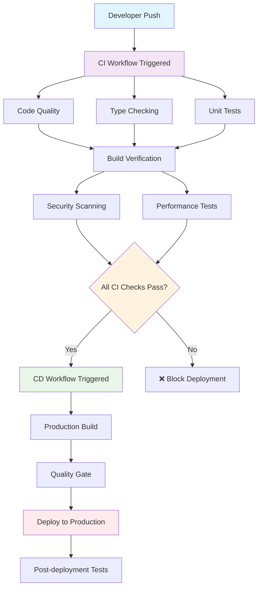
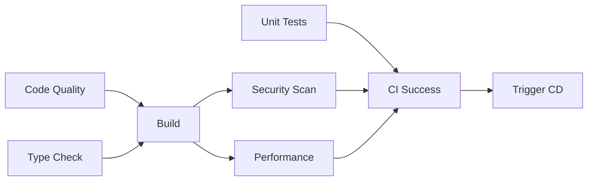
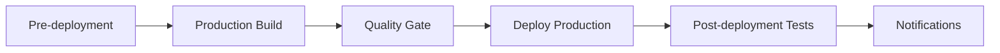

# 🚀 CI/CD Pipeline Guide - iAgent Project

This comprehensive guide explains the Continuous Integration (CI) and Continuous Deployment (CD) setup for the iAgent project. It's designed to be both educational and practical, perfect for learning CI/CD concepts.

## 📋 Table of Contents

1. [🎯 Overview](#-overview)
2. [🔄 CI/CD Concepts](#-cicd-concepts)
3. [🏗️ Pipeline Architecture](#-pipeline-architecture)
4. [🔍 Continuous Integration (CI)](#-continuous-integration-ci)
5. [🚀 Continuous Deployment (CD)](#-continuous-deployment-cd)
6. [📊 Workflow Visualization](#-workflow-visualization)
7. [🛠️ Setup & Configuration](#-setup--configuration)
8. [📈 Monitoring & Metrics](#-monitoring--metrics)
9. [🎓 Educational Resources](#-educational-resources)
10. [🔧 Troubleshooting](#-troubleshooting)

## 🎯 Overview

Our CI/CD pipeline is split into two main workflows:

- **🔍 CI (Continuous Integration)**: Automated code quality, testing, and validation
- **🚀 CD (Continuous Deployment)**: Automated deployment to various environments

### Why Split CI and CD?

1. **🔒 Security**: Deploy only after all quality checks pass
2. **⚡ Performance**: CI runs on every push, CD only on main branch
3. **🎯 Clarity**: Clear separation of concerns
4. **🔄 Flexibility**: Different triggers and environments for each stage

## 🔄 CI/CD Concepts

### What is CI/CD?

**Continuous Integration (CI)** is the practice of automatically testing and validating code changes as they're made.

**Continuous Deployment (CD)** is the practice of automatically deploying validated code changes to production.

### Key Benefits

- **🚫 Reduced Bugs**: Catch issues early and automatically
- **⚡ Faster Development**: Automated processes reduce manual work
- **🔒 Improved Quality**: Consistent testing and validation
- **📈 Better Collaboration**: Shared standards and processes
- **🎯 Faster Time to Market**: Automated deployments

### CI/CD Best Practices Implemented

- ✅ **Fail Fast**: Quick feedback on code issues
- ✅ **Test Automation**: Comprehensive automated testing
- ✅ **Environment Parity**: Consistent environments across stages
- ✅ **Version Control**: Everything in Git, including infrastructure
- ✅ **Rollback Strategy**: Easy rollback on deployment issues
- ✅ **Monitoring**: Comprehensive logging and metrics

## 🏗️ Pipeline Architecture



### Workflow Triggers

| Event | CI Workflow | CD Workflow |
|-------|-------------|-------------|
| Push to `main` | ✅ | ✅ (after CI) |
| Push to `develop` | ✅ | ❌ |
| Pull Request to `main` | ✅ | ❌ |
| Manual Trigger | ✅ | ✅ |

## 🔍 Continuous Integration (CI)

The CI workflow (`.github/workflows/ci.yml`) ensures code quality and functionality.

### CI Pipeline Stages

#### 1. 🧹 Code Quality & Linting
- **Purpose**: Ensure consistent code style and catch common issues
- **Tools**: ESLint, Prettier
- **Actions**:
  - Lint frontend and backend code
  - Check code formatting
  - Generate lint reports

```bash
# Manual execution
npm run lint                    # Lint all projects
npm run lint:frontend          # Lint frontend only
npm run lint:backend           # Lint backend only
npx prettier --check "**/*.ts" # Check formatting
```

#### 2. 🔧 TypeScript Type Checking
- **Purpose**: Ensure type safety across the codebase
- **Tools**: TypeScript Compiler
- **Actions**:
  - Type check frontend and backend
  - Generate compilation reports

```bash
# Manual execution
npx nx typecheck frontend  # Type check frontend
npx nx typecheck backend   # Type check backend
```

#### 3. 🧪 Unit Tests
- **Purpose**: Verify individual components work correctly
- **Tools**: Jest, Vitest
- **Strategy**: Matrix testing on Node.js 18 & 20
- **Actions**:
  - Run tests with coverage
  - Upload coverage to Codecov
  - Generate test reports

```bash
# Manual execution
npm test                        # Run all tests
npm run test:frontend          # Frontend tests only
npm run test:backend           # Backend tests only
npm run test:coverage          # With coverage
```

#### 4. 🏗️ Build Verification
- **Purpose**: Ensure code builds successfully for all configurations
- **Strategy**: Matrix builds (development/production)
- **Actions**:
  - Build frontend and backend
  - Analyze bundle sizes
  - Upload build artifacts

```bash
# Manual execution
npm run build                   # Build all projects
npx nx build frontend --prod   # Production frontend build
npx nx build backend --prod    # Production backend build
```

#### 5. 🔒 Security Scanning
- **Purpose**: Identify security vulnerabilities
- **Tools**: npm audit, CodeQL
- **Actions**:
  - Run dependency security audit
  - Static code analysis
  - Generate security reports

```bash
# Manual execution
npm audit                      # Security audit
npm audit --audit-level=high  # High severity only
```

#### 6. 📦 Dependency Analysis
- **Purpose**: Monitor dependency health and updates
- **Actions**:
  - Check for outdated packages
  - Analyze dependency tree
  - Nx project dependency analysis

#### 7. ⚡ Performance Testing
- **Purpose**: Ensure application performance meets standards
- **Tools**: Lighthouse CI
- **Actions**:
  - Performance audits
  - Bundle size analysis

### CI Success Criteria

All jobs must pass for CI to succeed:
- ✅ No linting errors
- ✅ No TypeScript errors
- ✅ All tests pass
- ✅ Successful builds
- ✅ No critical security issues
- ✅ Performance benchmarks met

## 🚀 Continuous Deployment (CD)

The CD workflow (`.github/workflows/cd.yml`) handles automated deployment after CI passes.

### CD Pipeline Stages

#### 1. 🔍 Pre-deployment Verification
- **Purpose**: Ensure deployment conditions are met
- **Actions**:
  - Verify CI success
  - Determine target environment
  - Set deployment URLs

#### 2. 🏗️ Production Build
- **Purpose**: Create optimized production builds
- **Strategy**: Matrix builds for frontend/backend
- **Actions**:
  - Build with production configurations
  - Create deployment packages
  - Analyze build output

#### 3. 🛡️ Production Quality Gate
- **Purpose**: Final security and quality checks
- **Actions**:
  - Scan for sensitive data in builds
  - Performance analysis
  - Bundle size verification

#### 4. 🌐 Deployment to Environments

##### Production Deployment
- **Target**: GitHub Pages
- **URL**: `https://morbargig.github.io/iAgent`
- **Trigger**: Successful CI on main branch
- **Features**:
  - Custom domain support
  - SEO optimization (robots.txt, sitemap)
  - Jekyll bypass (.nojekyll)

#### 5. 🧪 Post-deployment Testing
- **Purpose**: Verify deployment success
- **Actions**:
  - Connectivity tests
  - End-to-end testing
  - Performance validation with Lighthouse

#### 6. 📢 Deployment Notification
- **Purpose**: Inform team of deployment status
- **Features**:
  - Success/failure notifications
  - Deployment summary
  - Integration points for Slack/Discord

### Environment Configuration

| Environment | URL | Trigger | Purpose |
|-------------|-----|---------|---------|
| **Production** | GitHub Pages | CI success on main | Live application |
| **Development** | Local | Manual | Development testing |

## 📊 Workflow Visualization

### CI Workflow Dependencies



### CD Workflow Dependencies



## 🛠️ Setup & Configuration

### Required Secrets

For full functionality, configure these GitHub secrets:

```bash
# Optional: Code coverage
CODECOV_TOKEN=your_codecov_token

# Optional: Notifications
SLACK_WEBHOOK_URL=your_slack_webhook
DISCORD_WEBHOOK_URL=your_discord_webhook

# GitHub Token (automatically provided)
GITHUB_TOKEN=automatically_provided
```

### Environment Variables

Update these in the CD workflow:

```yaml
env:
  PRODUCTION_URL: 'https://morbargig.github.io/iAgent'
```

### Custom Domain Setup

For custom domain on GitHub Pages:

1. Uncomment CNAME lines in CD workflow
2. Update domain in workflow
3. Configure DNS settings

## 📈 Monitoring & Metrics

### Artifacts Generated

| Artifact | Purpose | Retention |
|----------|---------|-----------|
| Lint Results | Code quality reports | 30 days |
| Test Coverage | Test coverage reports | 30 days |
| Build Artifacts | Deployment packages | 30 days |
| Security Reports | Vulnerability reports | 30 days |
| Performance Reports | Lighthouse results | 30 days |

### Key Metrics to Monitor

- **🕐 Build Time**: Target < 10 minutes
- **✅ Success Rate**: Target > 95%
- **🧪 Test Coverage**: Target > 80%
- **📦 Bundle Size**: Monitor growth
- **🔒 Security Issues**: Target 0 critical
- **⚡ Performance Score**: Target > 90

### Monitoring Tools Integration

- **Codecov**: Test coverage tracking
- **Lighthouse**: Performance monitoring
- **GitHub Insights**: Workflow analytics
- **Custom Dashboards**: Combine metrics

## 🎓 Educational Resources

### Learning Objectives

After studying this CI/CD setup, you should understand:

1. **CI/CD Fundamentals**:
   - Difference between CI and CD
   - Benefits and best practices
   - Pipeline design principles

2. **GitHub Actions**:
   - Workflow syntax and structure
   - Job dependencies and artifacts
   - Matrix strategies and environments

3. **Testing Strategies**:
   - Unit testing with coverage
   - Integration testing
   - Performance testing

4. **Deployment Patterns**:
   - Blue-green deployments
   - Rolling deployments
   - Rollback strategies

5. **Security Practices**:
   - Static code analysis
   - Dependency scanning
   - Secrets management

### Hands-on Exercises

1. **Modify CI Workflow**:
   - Add a new linting rule
   - Extend test coverage requirements
   - Add a new security check

2. **Customize CD Pipeline**:
   - Implement blue-green deployment
   - Add custom notifications

3. **Performance Optimization**:
   - Implement caching strategies
   - Optimize build times
   - Parallel job execution

### Advanced Topics

- **Multi-environment deployments**
- **Feature flag integration**
- **A/B testing automation**
- **Infrastructure as Code (IaC)**
- **Monitoring and alerting**

## 🔧 Troubleshooting

### Common Issues

#### CI Failures

**Problem**: Linting errors
```bash
# Solution: Fix linting issues
npm run lint:fix
npx prettier --write "**/*.ts"
```

**Problem**: Test failures
```bash
# Solution: Run tests locally
npm test -- --verbose
npm run test:watch  # Watch mode for debugging
```

**Problem**: Build failures
```bash
# Solution: Check build locally
npm run build
npx nx build frontend --verbose
```

#### CD Failures

**Problem**: Deployment timeout
- Check GitHub Pages settings
- Verify repository permissions
- Check DNS configuration

**Problem**: Post-deployment tests fail
- Verify application is accessible
- Check for breaking changes
- Review deployment logs

### Debug Commands

```bash
# Local CI simulation
npm ci                    # Clean install
npm run lint             # Check linting
npm test                 # Run tests
npm run build           # Verify builds

# GitHub Actions debugging
# Add this step to any job:
- name: Debug environment
  run: |
    echo "Node version: $(node --version)"
    echo "NPM version: $(npm --version)"
    echo "Working directory: $(pwd)"
    echo "Environment variables:"
    env | grep -E "(NODE|NPM|CI)" | sort
```

### Performance Optimization

```yaml
# Optimize workflow performance
- name: Cache dependencies
  uses: actions/cache@v4
  with:
    path: ~/.npm
    key: ${{ runner.os }}-node-${{ hashFiles('**/package-lock.json') }}

# Parallel job execution
strategy:
  matrix:
    node-version: [18, 20]
  fail-fast: false  # Continue other jobs if one fails
```

## 📚 Additional Resources

- [GitHub Actions Documentation](https://docs.github.com/en/actions)
- [Nx Documentation](https://nx.dev)
- [CI/CD Best Practices](https://docs.github.com/en/actions/learn-github-actions/essential-features-of-github-actions)
- [Jest Testing Documentation](https://jestjs.io/docs/getting-started)
- [ESLint Configuration](https://eslint.org/docs/user-guide/configuring/)

---

**🎉 Happy Learning!** This CI/CD setup provides a solid foundation for understanding modern software delivery practices. Experiment with modifications and observe how changes affect the pipeline behavior. 