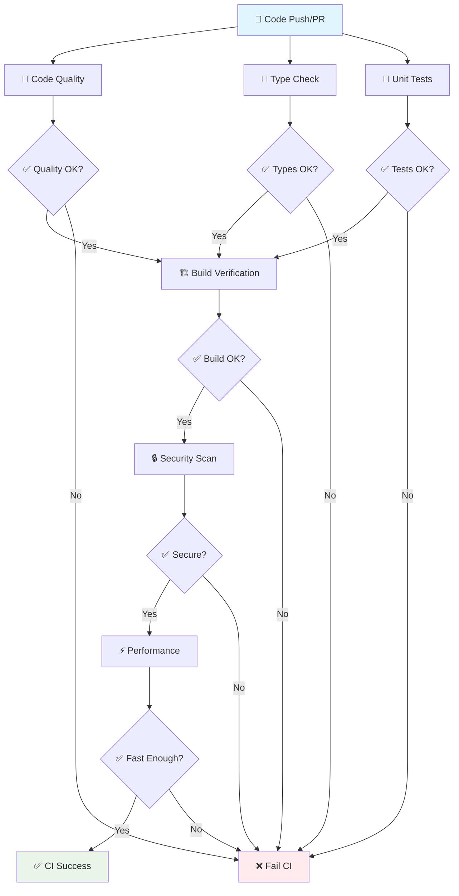

# 🔍 Continuous Integration (CI) Guide

This guide provides an in-depth explanation of our Continuous Integration pipeline, designed for learning and understanding CI best practices.

## 📋 Table of Contents

1. [🎯 What is Continuous Integration?](#-what-is-continuous-integration)
2. [🏗️ CI Pipeline Overview](#-ci-pipeline-overview)
3. [🔧 Stage-by-Stage Breakdown](#-stage-by-stage-breakdown)
4. [🛠️ Tools & Technologies](#-tools--technologies)
5. [📊 Matrix Strategies](#-matrix-strategies)
6. [🎓 Learning Exercises](#-learning-exercises)
7. [🔧 Local Testing](#-local-testing)
8. [📈 Monitoring & Metrics](#-monitoring--metrics)

## 🎯 What is Continuous Integration?

**Continuous Integration (CI)** is a development practice where developers integrate code into a shared repository frequently, preferably several times a day. Each integration is verified by automated build and test processes to detect integration errors as quickly as possible.

### Core Principles

1. **🔄 Frequent Integration**: Merge code changes often (multiple times per day)
2. **🤖 Automated Testing**: Every integration triggers automated tests
3. **⚡ Fast Feedback**: Quick notification of integration problems
4. **🔒 Quality Gates**: Prevent bad code from entering main branch
5. **👥 Shared Responsibility**: Everyone maintains the build

### Benefits of CI

- **🐛 Early Bug Detection**: Find issues when they're cheap to fix
- **🔒 Reduced Integration Risk**: Small, frequent changes are safer
- **📈 Better Code Quality**: Consistent quality checks
- **⚡ Faster Development**: Automated processes save time
- **👥 Improved Collaboration**: Shared standards and visibility

## 🏗️ CI Pipeline Overview

Our CI pipeline runs on every push to `main`/`develop` branches and all pull requests to `main`. Here's the high-level flow:



### Pipeline Triggers

| Event | Description | Purpose |
|-------|-------------|---------|
| **Push to main** | Direct commit to main branch | Validate production-ready code |
| **Push to develop** | Commit to development branch | Validate development code |
| **Pull Request** | PR opened/updated to main | Validate proposed changes |
| **Manual Trigger** | Workflow dispatch | Testing and debugging |

## 🔧 Stage-by-Stage Breakdown

### Stage 1: 🧹 Code Quality & Linting

**Purpose**: Ensure consistent code style and catch common programming errors.

**Duration**: ~2-3 minutes  
**Tools**: ESLint, Prettier  
**Runs on**: ubuntu-latest  

#### What happens:

1. **Setup Environment**
   ```yaml
   - name: Setup Node.js
     uses: actions/setup-node@v4
     with:
       node-version: '18'
       cache: 'npm'
   ```

2. **Install Dependencies**
   ```bash
   npm ci --prefer-offline --no-audit
   ```

3. **Cache Nx Computation**
   - Speeds up repeated runs
   - Shared across jobs

4. **Run Linting**
   ```bash
   # Frontend linting
   npx nx lint frontend --format=stylish
   
   # Backend linting  
   npx nx lint backend --format=stylish
   ```

5. **Check Code Formatting**
   ```bash
   npx prettier --check "apps/**/*.{ts,tsx,js,jsx,json,md}"
   ```

6. **Generate Reports**
   - Creates JSON lint reports
   - Uploads as artifacts for review

#### Success Criteria:
- ✅ No ESLint errors
- ✅ Code follows Prettier formatting
- ✅ No TypeScript-specific linting issues

#### Manual Testing:
```bash
# Test locally before pushing
npm run lint                    # Check all projects
npm run lint:fix               # Auto-fix issues
npx prettier --write "**/*.ts" # Format code
```

---

### Stage 2: 🔧 TypeScript Type Checking

**Purpose**: Ensure type safety across the entire codebase.

**Duration**: ~2-3 minutes  
**Tools**: TypeScript Compiler  
**Runs on**: ubuntu-latest  

#### What happens:

1. **Type Check Frontend**
   ```bash
   npx nx typecheck frontend
   ```
   - Checks React components
   - Validates prop types
   - Ensures type imports are correct

2. **Type Check Backend**
   ```bash
   npx nx typecheck backend
   ```
   - Validates NestJS decorators
   - Checks service dependencies
   - Ensures DTO type safety

3. **Generate TypeScript Report**
   ```bash
   npx tsc --noEmit --pretty > typescript-report.log
   ```

#### Success Criteria:
- ✅ No TypeScript compilation errors
- ✅ All types properly defined
- ✅ No `any` types (if strict mode enabled)

#### Manual Testing:
```bash
# Test locally
npx nx typecheck frontend
npx nx typecheck backend
npx tsc --noEmit  # Check entire workspace
```

---

### Stage 3: 🧪 Unit Tests (Matrix Strategy)

**Purpose**: Verify that individual components work correctly in isolation.

**Duration**: ~5-8 minutes  
**Tools**: Jest (backend), Vitest (frontend)  
**Strategy**: Matrix testing on multiple Node.js versions  

#### Matrix Configuration:
```yaml
strategy:
  matrix:
    node-version: ['18', '20']
    project: ['frontend', 'backend']
  fail-fast: false
```

This creates 4 parallel jobs:
- Node 18 + Frontend
- Node 18 + Backend  
- Node 20 + Frontend
- Node 20 + Backend

#### What happens in each job:

1. **Setup Node.js** (version from matrix)
2. **Install Dependencies**
3. **Run Tests with Coverage**
   ```bash
   npx nx test ${{ matrix.project }} --coverage --watchAll=false --passWithNoTests
   ```

4. **Upload Coverage** (Node 18 only)
   - Sends to Codecov
   - Generates coverage badges
   - Tracks coverage trends

5. **Save Test Results**
   - JUnit XML reports
   - Coverage reports
   - Test artifacts

#### Success Criteria:
- ✅ All tests pass on all Node versions
- ✅ Test coverage meets thresholds
- ✅ No failing or skipped tests

#### Manual Testing:
```bash
# Test locally
npm test                    # All tests
npm run test:frontend      # Frontend only
npm run test:backend       # Backend only
npm run test:coverage      # With coverage
npm run test:watch         # Watch mode
```

---

### Stage 4: 🏗️ Build Verification (Matrix Strategy)

**Purpose**: Ensure code compiles and builds successfully for all configurations.

**Duration**: ~4-6 minutes  
**Strategy**: Matrix builds for different configurations  

#### Matrix Configuration:
```yaml
strategy:
  matrix:
    project: ['frontend', 'backend']
    configuration: ['development', 'production']
```

This creates 4 parallel jobs:
- Frontend Development Build
- Frontend Production Build
- Backend Development Build  
- Backend Production Build

#### What happens:

1. **Build Project**
   ```bash
   npx nx build ${{ matrix.project }} --configuration=${{ matrix.configuration }}
   ```

2. **Analyze Bundle Size** (Frontend Production only)
   ```bash
   du -sh dist/apps/frontend
   find dist/apps/frontend -name "*.js" -exec du -h {} \;
   ```

3. **Upload Build Artifacts** (Production builds only)
   - Stores built applications
   - Available for deployment stage
   - Retained for 30 days

#### Success Criteria:
- ✅ Successful builds for all configurations
- ✅ No build warnings or errors
- ✅ Bundle sizes within acceptable limits

#### Manual Testing:
```bash
# Test locally
npm run build                       # All projects
npx nx build frontend --prod       # Production frontend
npx nx build backend --configuration=development
```

---

### Stage 5: 🔒 Security Scanning

**Purpose**: Identify security vulnerabilities in dependencies and code.

**Duration**: ~3-5 minutes  
**Tools**: npm audit, CodeQL  

#### What happens:

1. **Dependency Security Audit**
   ```bash
   npm audit --audit-level=high --no-fund
   ```
   - Checks for known vulnerabilities
   - Reports severity levels
   - Suggests fixes

2. **CodeQL Static Analysis** (when available)
   ```yaml
   - uses: github/codeql-action/analyze@v3
     with:
       languages: javascript,typescript
   ```
   - Analyzes code patterns
   - Finds potential security issues
   - Reports suspicious code

3. **Generate Security Report**
   ```bash
   npm audit --json > security-audit.json
   ```

#### Success Criteria:
- ✅ No critical or high severity vulnerabilities
- ✅ CodeQL finds no security issues
- ✅ All dependencies are up to date

#### Manual Testing:
```bash
# Test locally
npm audit                          # Basic audit
npm audit --audit-level=high      # High severity only
npm audit fix                      # Auto-fix issues
```

---

### Stage 6: 📦 Dependency Analysis

**Purpose**: Monitor dependency health and identify outdated packages.

**Duration**: ~2-3 minutes  

#### What happens:

1. **Check Outdated Packages**
   ```bash
   npm outdated
   ```

2. **Analyze Dependency Tree**
   ```bash
   npx nx graph --file=dependency-graph.json
   ```

3. **Nx Project Dependencies**
   ```bash
   npx nx affected:dep-graph --file=affected-graph.json
   ```

#### Success Criteria:
- ✅ No critical package updates needed
- ✅ Dependency tree is healthy
- ✅ No circular dependencies

---

### Stage 7: ⚡ Performance Testing

**Purpose**: Ensure application meets performance benchmarks.

**Duration**: ~3-5 minutes  
**Tools**: Lighthouse CI  
**Depends on**: Build stage success  

#### What happens:

1. **Download Frontend Build**
   - Gets production build artifact
   - Prepares for testing

2. **Start Preview Server**
   ```bash
   npx nx preview frontend &
   sleep 10  # Wait for server startup
   ```

3. **Run Lighthouse Audit**
   ```bash
   npm install -g @lhci/cli
   lhci autorun --upload.target=temporary-public-storage
   ```

#### Success Criteria:
- ✅ Performance score > 90
- ✅ Accessibility score > 95
- ✅ Best practices score > 90
- ✅ SEO score > 90

---

### Stage 8: ✅ CI Success Summary

**Purpose**: Provide clear feedback on CI pipeline results.

**Duration**: ~1 minute  
**Depends on**: All previous stages  

#### What happens:

1. **Check All Job Results**
   ```yaml
   if: ${{ !contains(needs.*.result, 'failure') && !contains(needs.*.result, 'cancelled') }}
   ```

2. **Generate Summary Report**
   - Lists all job statuses
   - Provides clear pass/fail indication
   - Links to detailed logs

3. **Trigger CD** (if all pass and on main branch)

## 🛠️ Tools & Technologies

### Core Tools

| Tool | Purpose | Configuration |
|------|---------|---------------|
| **ESLint** | Code linting | `eslint.config.mjs` |
| **Prettier** | Code formatting | `.prettierrc` |
| **TypeScript** | Type checking | `tsconfig.json` |
| **Jest** | Backend testing | `jest.config.ts` |
| **Vitest** | Frontend testing | `vite.config.ts` |
| **Nx** | Monorepo management | `nx.json` |

### GitHub Actions Features

| Feature | Usage | Benefit |
|---------|-------|---------|
| **Matrix Strategy** | Test multiple configurations | Comprehensive coverage |
| **Artifact Upload** | Store build outputs | Cross-job data sharing |
| **Caching** | Speed up workflows | Faster execution |
| **Concurrency** | Cancel old runs | Resource efficiency |
| **Environments** | Deployment targets | Access control |

## 📊 Matrix Strategies

### Why Use Matrix Strategies?

Matrix strategies allow us to test multiple configurations in parallel:

1. **Node Version Compatibility**
   - Test on Node 18 (LTS) and Node 20 (Current)
   - Catch version-specific issues early
   - Ensure future compatibility

2. **Build Configuration Testing**
   - Development builds (faster, more debugging info)
   - Production builds (optimized, minified)
   - Catch configuration-specific issues

3. **Project Isolation**
   - Test frontend and backend separately
   - Parallel execution for speed
   - Clear failure attribution

### Matrix Job Example

```yaml
strategy:
  matrix:
    include:
      - node-version: '18'
        project: 'frontend'
        os: 'ubuntu-latest'
      - node-version: '18'
        project: 'backend'
        os: 'ubuntu-latest'
      - node-version: '20'
        project: 'frontend'
        os: 'ubuntu-latest'
      - node-version: '20'
        project: 'backend'
        os: 'ubuntu-latest'
  fail-fast: false  # Continue other jobs if one fails
```

## 🎓 Learning Exercises

### Beginner Exercises

1. **Add a New Lint Rule**
   ```javascript
   // In eslint.config.mjs, add:
   rules: {
     'no-console': 'error',  // Disallow console.log
     'prefer-const': 'error' // Prefer const over let
   }
   ```

2. **Increase Test Coverage Threshold**
   ```javascript
   // In jest.config.ts, add:
   coverageThreshold: {
     global: {
       branches: 80,
       functions: 80,
       lines: 80,
       statements: 80
     }
   }
   ```

3. **Add a Custom Security Check**
   ```yaml
   - name: Check for TODO comments
     run: |
       if grep -r "TODO\|FIXME" apps/ --exclude-dir=node_modules; then
         echo "Found TODO/FIXME comments - please resolve"
         exit 1
       fi
   ```

### Intermediate Exercises

1. **Add Browser Testing**
   ```yaml
   - name: Install Playwright
     run: npx playwright install
   
   - name: Run E2E tests
     run: npx playwright test
   ```

2. **Implement Custom Caching**
   ```yaml
   - name: Cache test results
     uses: actions/cache@v4
     with:
       path: coverage/
       key: coverage-${{ github.sha }}
   ```

3. **Add Performance Budgets**
   ```javascript
   // In lighthouse config
   budgets: [{
     path: '/*',
     timings: [
       { metric: 'first-contentful-paint', budget: 2000 },
       { metric: 'largest-contentful-paint', budget: 4000 }
     ]
   }]
   ```

### Advanced Exercises

1. **Multi-OS Testing**
   ```yaml
   strategy:
     matrix:
       os: [ubuntu-latest, windows-latest, macos-latest]
       node-version: [18, 20]
   ```

2. **Custom GitHub Action**
   ```yaml
   # .github/actions/custom-test/action.yml
   name: 'Custom Test Action'
   description: 'Run custom tests'
   inputs:
     project:
       description: 'Project to test'
       required: true
   runs:
     using: 'node20'
     main: 'index.js'
   ```

3. **Parallel Test Execution**
   ```yaml
   - name: Run tests in parallel
     run: |
       npx jest --maxWorkers=50%
       npx nx affected:test --parallel=3
   ```

## 🔧 Local Testing

Before pushing code, test CI steps locally:

### Complete Local CI Simulation

```bash
#!/bin/bash
# local-ci.sh - Simulate CI pipeline locally

echo "🔍 Starting Local CI Simulation..."

# 1. Code Quality
echo "🧹 Running code quality checks..."
npm run lint || exit 1
npx prettier --check "**/*.{ts,tsx,js,jsx}" || exit 1

# 2. Type Checking
echo "🔧 Running type checks..."
npx nx typecheck frontend || exit 1
npx nx typecheck backend || exit 1

# 3. Tests
echo "🧪 Running tests..."
npm test || exit 1

# 4. Build
echo "🏗️ Building projects..."
npm run build || exit 1

# 5. Security
echo "🔒 Running security checks..."
npm audit --audit-level=moderate || exit 1

echo "✅ Local CI simulation completed successfully!"
```

### Quick Pre-commit Checks

```bash
#!/bin/bash
# pre-commit.sh - Quick checks before committing

npm run lint:fix           # Auto-fix linting issues
npx prettier --write "**/*.ts"  # Format code
npm test -- --passWithNoTests  # Run tests
npm run build              # Verify builds
```

## 📈 Monitoring & Metrics

### Key Metrics to Track

1. **Build Success Rate**
   - Target: > 95%
   - Track weekly/monthly trends
   - Identify problematic patterns

2. **Build Duration**
   - Target: < 10 minutes total
   - Monitor individual stage times
   - Optimize slow stages

3. **Test Coverage**
   - Target: > 80% overall
   - Track per-project coverage
   - Monitor coverage trends

4. **Security Issues**
   - Target: 0 critical issues
   - Track resolution time
   - Monitor new vulnerabilities

### Monitoring Tools

- **GitHub Insights**: Built-in workflow analytics
- **Codecov**: Test coverage tracking and trends
- **Dependabot**: Automated dependency updates
- **Custom dashboards**: Combine metrics from multiple sources

### Setting Up Alerts

```yaml
# Example: Slack notification on CI failure
- name: Notify on failure
  if: failure()
  run: |
    curl -X POST -H 'Content-type: application/json' \
      --data '{"text":"CI failed for ${{ github.repository }}"}' \
      ${{ secrets.SLACK_WEBHOOK_URL }}
```

---

**🎉 Congratulations!** You now have a comprehensive understanding of our CI pipeline. The next step is to explore the [CD Guide](./CD-GUIDE.md) to learn about deployment processes. 